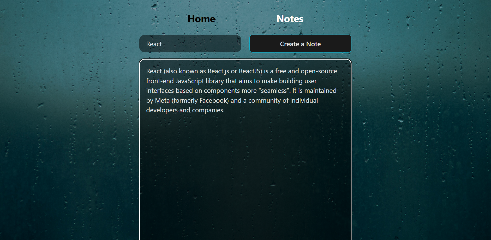
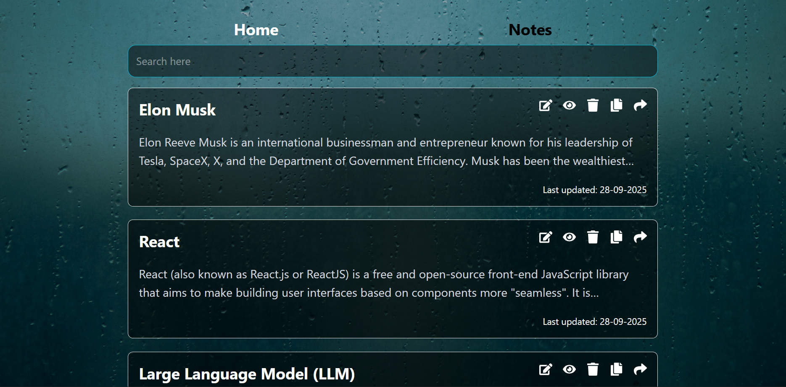

# React Notepad 📝

A simple and responsive **Notepad application** built using **React.js** and **Tailwind CSS**.  
This app allows you to create, view, edit, delete, copy, and share notes seamlessly.

---

## Features

- **Create Notes**: Add new notes with a title and content.
- **View Notes**: See all your notes in one place.
- **Edit Notes**: Update the title or content of existing notes.
- **Delete Notes**: Remove unwanted notes.
- **Copy Notes**: Copy the content of a note to clipboard.
- **Share Notes**: Generate a shareable link to your notes.
- **Responsive Design**: Works well on mobile, tablet, and desktop.

---

## Screenshots

### Home / Create Note

### Notes List / View & Edit

---

